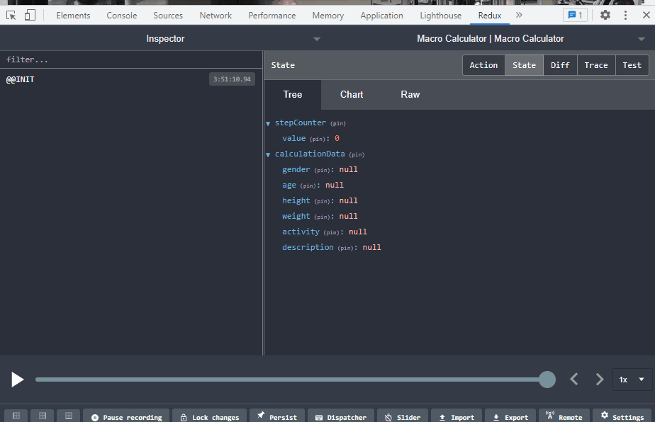

<!-- AUTO-GENERATED-CONTENT:START (STARTER) -->
<p align="center">
  <a href="https://www.gatsbyjs.com">
    
  </a>
</p>
<h1 align="center">
  Macro Calculator 
</h1>

## 🚀 Live Demo

Visit the [Live Demo](https://macro-calc.web.app/)

https://macro-calc.web.app/

```
firebase deploy --only hosting:macro-calc
```


# Redux Store Changes

After each user action, Redux store actions are dispatched to the store and update the state of the application. There are two slices in the store. 'CalculationData' slice stores the data related to macro calucuation.

